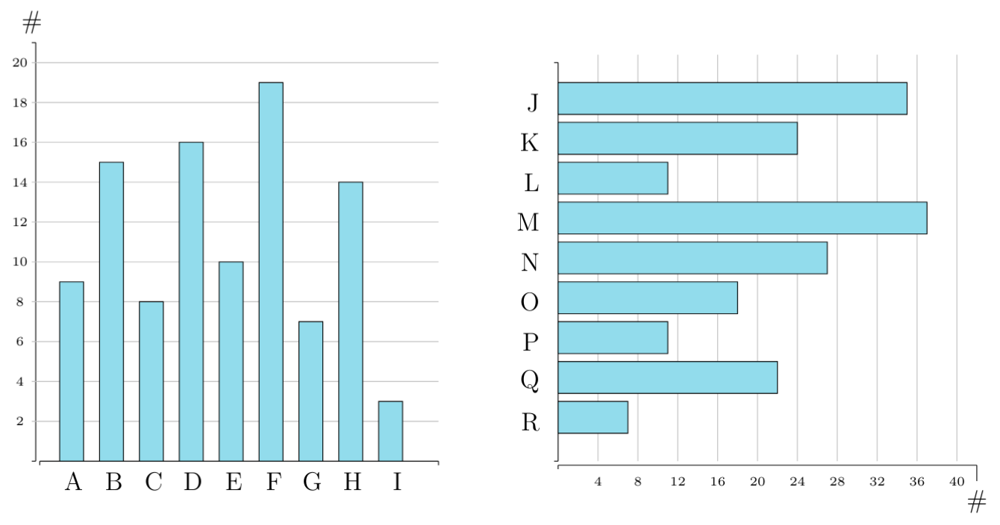

<!--
version:  0.0.1

language: de

@style
input {
    text-align: center;
}

.flex-container {
    display: flex;
    flex-wrap: wrap;
    align-items: stretch;
    gap: 20px;
}

.flex-child { 
    flex: 1;
    min-width: 350px;
    margin-right: 20px;
}

@media (max-width: 400px) {
    .flex-child {
        flex: 100%;
        margin-right: 0;
    }
}
@end

formula: \carry   \textcolor{red}{\scriptsize #1}
formula: \digit   \rlap{\carry{#1}}\phantom{#2}#2

import: https://raw.githubusercontent.com/liaTemplates/algebrite/master/README.md

script: dist/index.js

-->

# Wochenaufgaben

Die Wochenaufgaben dienen zur Wiederholung von grundlegenden Themen innerhalb des Unterrichts, welche in vielen Aufgaben im Unterricht in Verbindung mit neuem Lerninhalt vorkommen können.
Hierbei werden gut verteilt Aufgaben aus allen vorherigen Jahrgangstufen in unregelmäßigen Abständen aufgegriffen.
Auch werden Aufgaben im aktuellen Jahrgang gestellt, sodass diese zur Festigung des Unterrichtsinhaltes dienen können.
Falls gesamte Aufgaben nicht lösbar erscheinen, kann dies daran liegen, dass die Lehrer im aktuellen Jahrgang sich für eine andere Abfolge der Themen entschieden haben.
Außerdem kann es vorkommen, dass diese Themen schon im vorherigen Schuljahr erlernt, aber wieder vergessen wurden.
Aus diesem Grund wird bei generellen Schwierigkeiten bei der Bearbeitung der aktuellen Klassenstufe empfohlen Wochenaufgaben von niedrigeren Klassenstufen zu bearbeiten.
Es werden jeden Montag die Aufgaben gewechselt und Beispiellösungen zur vergangenen Woche bereitgestellt.

---

> ___Die hier gestellten Aufgaben wurden nach LiaScript zu testzwecken von der folgenden Seite übernommen und in LiaScript umgewandelt.___
>
> https://wochenaufgaben.gsg-freiberg.de

## Wochenaufgabe 18


### Aufgabe 1

Berechne den Wert der Terms.

<section class="flex-container">

<div class="flex-child">
__a)__

$$
\begin{array}{r}
 467643 \\
+153466 \\
+397618 \\
\hline
\end{array}
$$

[[1018727]]
***********
$$
\begin{matrix}
  &  \digit{}{4} &  \digit{}{6} &  \digit{}{7} &  \digit{}{6} &  \digit{}{4} &  \digit{}{3} \\
+ &  \digit{}{1} &  \digit{}{5} &  \digit{}{3} &  \digit{}{4} &  \digit{}{6} &  \digit{}{6} \\
+ & \digit{1}{3} & \digit{2}{9} & \digit{1}{7} & \digit{1}{6} & \digit{1}{1} & \digit{1}{8} \\
\hline
\digit{}{1} & \digit{}{0} & \digit{}{1} & \digit{}{8} & \digit{}{7} & \digit{}{2} & \digit{}{7} \\
\end{matrix}
$$
***********
</div>

<div class="flex-child">
__b)__

$$
\begin{array}{r}
  648923 \\
+ 153979 \\
+ 367046 \\
\hline
\end{array}
$$

[[1169948]]
***********
$$
\begin{matrix}
  &  \digit{}{6} &  \digit{}{4} &  \digit{}{8} &  \digit{}{9} &  \digit{}{2} &  \digit{}{3} \\
+ &  \digit{}{1} &  \digit{}{5} &  \digit{}{3} &  \digit{}{9} &  \digit{}{7} &  \digit{}{9} \\
+ & \digit{1}{3} & \digit{1}{6} & \digit{1}{7} & \digit{1}{0} & \digit{1}{4} & \digit{1}{6} \\
\hline
\digit{}{1} & \digit{}{1} & \digit{}{6} & \digit{}{9} & \digit{}{9} & \digit{}{4} & \digit{}{8} \\
\end{matrix}
$$
***********
</div>

<div class="flex-child">
__c)__

$$
\begin{array}{r}
  568074 \\
+ 404669 \\
+ 646004 \\
\hline
\end{array}
$$

[[1618747]]
***********
$$
\begin{matrix}
  &  \digit{}{5} &  \digit{}{6} &  \digit{}{8} & \digit{}{0} &  \digit{}{7} &  \digit{}{4} \\
+ &  \digit{}{4} &  \digit{}{0} &  \digit{}{4} & \digit{}{6} &  \digit{}{6} &  \digit{}{9} \\
+ & \digit{1}{6} & \digit{1}{4} & \digit{1}{6} & \digit{}{0} & \digit{1}{0} & \digit{1}{4} \\
\hline
\digit{}{1} & \digit{}{6} & \digit{}{1} & \digit{}{8} & \digit{}{7} & \digit{}{4} & \digit{}{7} \\
\end{matrix}
$$
***********

</div>

<div class="flex-child">
__d)__

$$
\begin{array}{r}
  930456 \\
+ 648997 \\
+ 579616 \\
\hline
\end{array}
$$

[[2151069]]
***********
$$
\begin{matrix}
  &  \digit{}{9} &  \digit{}{3} &  \digit{}{0} &  \digit{}{4} &  \digit{}{5} &  \digit{}{6} \\
+ &  \digit{}{6} &  \digit{}{4} &  \digit{}{8} &  \digit{}{9} &  \digit{}{9} &  \digit{}{7} \\
+ & \digit{2}{5} & \digit{1}{7} & \digit{1}{9} & \digit{2}{6} & \digit{1}{1} & \digit{1}{6} \\
\hline
\digit{}{2} & \digit{}{1} & \digit{}{5} & \digit{}{1} & \digit{}{0} & \digit{}{6} & \digit{}{9}
\end{matrix}
$$
***********

</div>

<div class="flex-child">
__e)__

$$
\begin{array}{r}
  291972 \\
+ 192792 \\
+ 348587 \\
\hline
\end{array}
$$

[[833351]]
***********
$$
\begin{matrix}
  & \digit{}{2} &  \digit{}{9} &  \digit{}{1} &  \digit{}{9} &  \digit{}{7} &  \digit{}{2} \\
+ & \digit{}{1} &  \digit{}{9} &  \digit{}{2} &  \digit{}{7} &  \digit{}{9} &  \digit{}{2} \\
+ & \digit{}{3} & \digit{2}{4} & \digit{1}{8} & \digit{2}{5} & \digit{2}{8} & \digit{1}{7} \\
\hline
\digit{}{8} & \digit{}{3} & \digit{}{3} & \digit{}{3} & \digit{}{5} & \digit{}{1} & \digit{}{1}
\end{matrix}
$$
***********

</div>

</section>

### Aufgabe 2

Berechne den Wert der Terms.

__a)__ Zu dem Product aus 11 und 8 wird 23 addiert.

[[65]]
******
$$ \Rightarrow 11 \cdot 8 − 23 = 88 − 23 = 65 $$
******

---

__b)__ Der Quotient aus dem Dividenden 340 mit dem Divisor 17 wird durch 10 dividiert.

[[2]]
******
$$ \Rightarrow (340 : 17) : 10 = 20 : 10 = 2 $$
******

---

__c)__ Die Summe aus 47 und 29 wird mit 25 multipliziert.

[[1900]]
******
$$ \Rightarrow (47 + 29) \cdot 25 = 76 \cdot 25 = 1900 $$
******

---

__d)__ Vom Produkt aus den Faktoren 13 und 42 wird 127 subtrahiert.

[[419]]
******
$$ \Rightarrow 13 \cdot 42 − 127 = 546 − 127 = 419 $$
******

### Aufgabe 3

In einer Stadt soll eine neue Buslinie eingerichtet werden.
Hierzu werden 15 Busse benötigt.
Ein Bus kostet in der Anschaffung 157.000 €.
Berechne wie viel Geld die Stadt für die neue Busflotte ausgeben muss.

[[2355000]]
***********
$$157.000 € \cdot 15 = 2.355.000 €$$

Die Stadt muss 2.355.000 € für die neue Busflotte ausgeben.
***********

### Aufgabe 4

Beantworte alle Fragen.

1. Wie viel Meter sind 7200 Zentimeter? => [[ 72 ]] $\, \mathrm{m}$
   **********
   $$ 7200 \, \mathrm{cm} = 7200 \, \mathrm{cm} : 100 = 72 \, \mathrm{m} $$
   **********

2. Wie viel Kilogramm sind 450000 Gramm? => [[ 450 ]] $\, \mathrm{kg}$
   ********
   $$ 450000 \, \mathrm{g} = 450000 \, \mathrm{g} : 1000 = 450 \, \mathrm{kg} $$
   ********

3. Wie viel Stunden sind 480 Minuten? => [[ 8 ]] $\, \mathrm{h}$
   ********
   $$ 480 \, \mathrm{min} = 480  \, \mathrm{min} : 60 = 8  \, \mathrm{h} $$
   ********

4. Wie viel Dezimeter sind elf Meter? => [[ 110 ]] $\, \mathrm{dm}$
   ********
   $$ 11 \, \mathrm{m} = 11 \, \mathrm{m} \cdot 10 = 110 \, \mathrm{dm} $$
   ********

5. Wie viele Sekunden haben drei Stunden? => [[ 10800 ]] $\, \mathrm{s}$
   ********
   $$ 3 \, \mathrm{h} = 3 \cdot 60 \, \mathrm{min} = 3 \cdot 60 \cdot 60 \, \mathrm{s} = 10800 \, \mathrm{s} $$
   ********

6. Wie viel Millimeter sind 73 Zentimeter? => [[ 7300 ]] $\, \mathrm{mm}$
   ********
   $$ 73 \, \mathrm{cm} = 73 \, \mathrm{mm} \cdot 100 = 7300 \, \mathrm{mm} $$
   ********

## Wochenaufgabe 19

### Aufgabe 1

Zeige, dass die Gleichung stimmt, indem beide Seiten vom Gleichheitszeiten den gleichen Wert haben müssen.

$$
(453436 - 392355) · 4 = ((76962060 : 5) : 9) : 7
$$

---

> mathsteps, muss natürlich noch übersetzt werden.
>
> https://www.npmjs.com/package/mathsteps

``` octave
(453436 - 392355) * 4 = ((76962060 / 5) / 9) / 7
```
<script>
const steps = mathsteps.solveEquation('@input');
 
steps.forEach(step => {
    // console.log("before change: " + JSON.stringify(step, null, 2));  // e.g. before change: 2x + 3x = 35
    console.log("Vor der Änderung: " + (step.oldEquation?.ascii() || ""));  // e.g. before change: 2x + 3x = 35
    console.debug("Änderung: " + step.changeType);                  // e.g. change: SIMPLIFY_LEFT_SIDE
    console.log("Nach der Änderung: " + step.newEquation.ascii());   // e.g. after change: 5x = 35
    console.debug("Anzahl von Schritten: " + step.substeps.length);      // e.g. # of substeps: 2
});

"fertig ..."
</script>

### Aufgabe 2

Berechne den Wert der Terms.


<section class="flex-container">

<div class="flex-child">

_a)_

$$
\begin{array}{r}
71819 \\
-5612 \\
-4568 \\
-5108 \\
-8491 \\
\hline
\end{array}
$$

[[48040]]
***********
$$
\begin{matrix}
  \digit{}{7} &   \digit{}{1} &   \digit{}{8} &   \digit{}{1} &   \digit{}{9} \\
            - &   \digit{}{5} &   \digit{}{6} &   \digit{}{1} &   \digit{}{2} \\
            - &   \digit{}{4} &   \digit{}{5} &   \digit{}{6} &   \digit{}{8} \\
            - &   \digit{}{5} &   \digit{}{1} &   \digit{}{0} &   \digit{}{8} \\
            - & \digit{-3}{8} & \digit{-1}{4} & \digit{-1}{9} & \digit{-1}{1} \\
\hline
  \digit{}{4} &  \digit{}{8} &  \digit{}{0} &  \digit{}{4} &  \digit{}{0} \\
\end{matrix}
$$
***********

</div>

<div class="flex-child">
b)

$$
\begin{array}{r}
84105 \\
-4674 \\
-5862 \\
-7818 \\
-6157 \\
\hline
\end{array}
$$

[[65694]]
***********
$$
\begin{matrix}
  \digit{}{8} &   \digit{}{4} &   \digit{}{1} &   \digit{}{0} &   \digit{}{5} \\
            - &   \digit{}{4} &   \digit{}{6} &   \digit{}{7} &   \digit{}{4} \\
            - &   \digit{}{5} &   \digit{}{8} &   \digit{}{6} &   \digit{}{2} \\
            - &   \digit{}{7} &   \digit{}{8} &   \digit{}{1} &   \digit{}{8} \\
            - &   \digit{}{6} &   \digit{}{1} &   \digit{}{5} &   \digit{}{7} \\
\hline
    \digit{}{6} &  \digit{}{5} &  \digit{}{6} &  \digit{}{9} &  \digit{}{4} \\
\end{matrix}
$$
***********

</div>

<div class="flex-child">

c)

$$
\begin{array}{r}
31480 \\
-9635 \\
-5890 \\
-6447 \\
-7189 \\
\hline
\end{array}
$$

[[1119]]
***********
$$
\begin{matrix}
  \digit{}{3} &   \digit{}{1} &   \digit{}{4} &   \digit{}{8} &   \digit{}{0} \\
            - &   \digit{}{9} &   \digit{}{6} &   \digit{}{3} &   \digit{}{5} \\
            - &   \digit{}{5} &   \digit{}{8} &   \digit{}{9} &   \digit{}{0} \\
            - &   \digit{}{6} &   \digit{}{4} &   \digit{}{4} &   \digit{}{7} \\
            - &   \digit{}{7} &   \digit{}{1} &   \digit{}{8} &   \digit{}{9} \\
\hline
    \digit{}{1} &  \digit{}{1} &  \digit{}{1} &  \digit{}{9} &  \digit{}{0} \\
\end{matrix}
$$
***********

</div>

<div class="flex-child">
__d)__

$$
\begin{array}{r}
94411 \\
-7454 \\
-9416 \\
-3467 \\
-4829 \\
\hline
\end{array}
$$

[[70245]]
***********
$$
\begin{matrix}
  \digit{}{9} &   \digit{}{4} &   \digit{}{4} &   \digit{}{1} &   \digit{}{1} \\
            - &   \digit{}{7} &   \digit{}{4} &   \digit{}{5} &   \digit{}{4} \\
            - &   \digit{}{9} &   \digit{}{4} &   \digit{}{1} &   \digit{}{6} \\
            - &   \digit{}{3} &   \digit{}{4} &   \digit{}{6} &   \digit{}{7} \\
            - &   \digit{}{4} &   \digit{}{8} &   \digit{}{2} &   \digit{}{9} \\
\hline
    \digit{}{7} &  \digit{}{0} &  \digit{}{2} &  \digit{}{4} &  \digit{}{5} \\
\end{matrix}
$$
***********

</div>

<div class="flex-child">
__e)__

$$
\begin{array}{r}
57952 \\
-2367 \\
-5890 \\
-3478 \\
-6814 \\
\hline
\end{array}
$$

[[39403]]
***********
$$
\begin{matrix}
  \digit{}{5} &   \digit{}{7} &   \digit{}{9} &   \digit{}{5} &   \digit{}{2} \\
            - &   \digit{}{2} &   \digit{}{3} &   \digit{}{6} &   \digit{}{7} \\
            - &   \digit{}{5} &   \digit{}{8} &   \digit{}{9} &   \digit{}{0} \\
            - &   \digit{}{3} &   \digit{}{4} &   \digit{}{7} &   \digit{}{8} \\
            - &   \digit{}{6} &   \digit{}{8} &   \digit{}{1} &   \digit{}{4} \\
\hline
- & \digit{-3}{8} & \digit{-1}{4} & \digit{-1}{9} & \digit{-1}{1} \\
$$
***********

</div>

</section>

### Aufgabe 3

Bestimme die Anzahl der Stimmen, die jede Partei bekommen hat, aus dem Balken-
sowie Säulendiagramm.



<section class="flex-container">

<div class="flex-child">
<!--
daty-type="barchart"
class="flex-child"
data-show-partial-solution
-->
| Partei |     #      |
| :----: | :--------: |
|   A    | [[   9  ]] |
|   B    | [[  15  ]] |
|   C    | [[   8  ]] |
|   D    | [[  16  ]] |
|   E    | [[  10  ]] |
|   F    | [[  19  ]] |
|   G    | [[   7  ]] |
|   H    | [[  14  ]] |
|   I    | [[   3  ]] |
</div>

<div class="flex-child">
<!-- 
daty-type="barchart"
data-orientation="horizontal"
data-show-partial-solution
-->
| Partei |     #      |
| :----: | :--------: |
|   J    | [[  35  ]] |
|   K    | [[  24  ]] |
|   L    | [[  11  ]] |
|   M    | [[  37  ]] |
|   N    | [[  27  ]] |
|   O    | [[  18  ]] |
|   P    | [[  11  ]] |
|   Q    | [[  22  ]] |
|   R    | [[   7  ]] |
</div>

</section>